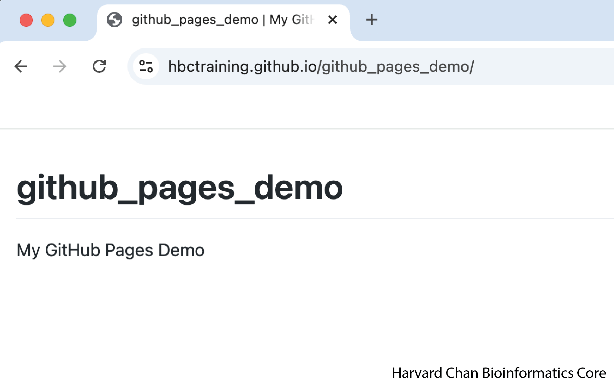
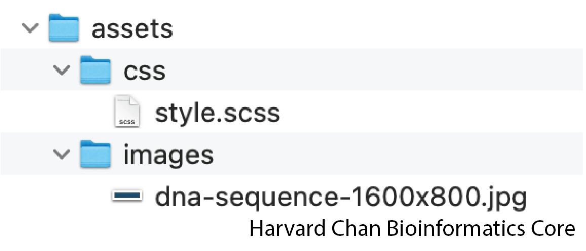
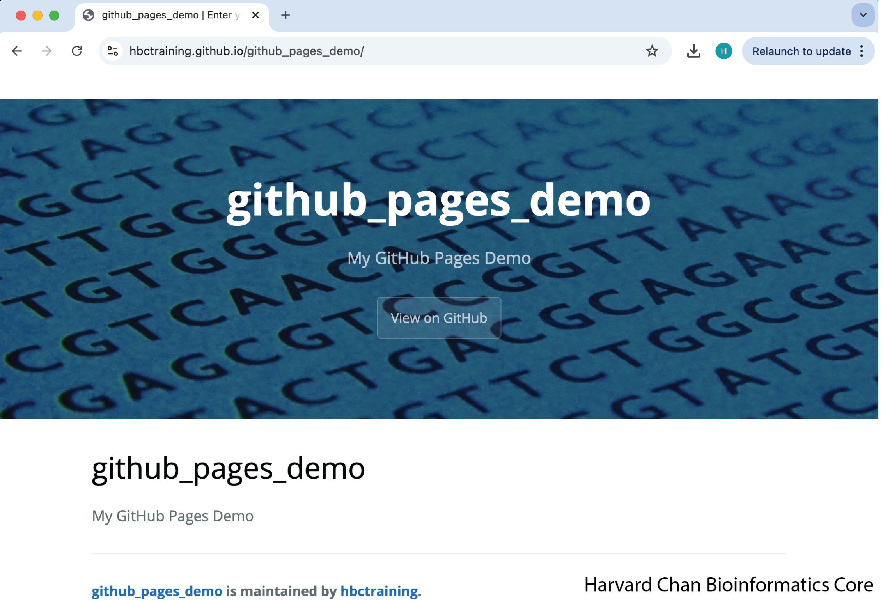

# Creating GitHub Pages

## Learning Objectives

In this lesson we will discuss:

- Development of a custom GitHub Pages HTML

## Create a new repository

**1.** Go to your GitHub account and click on **"New"** to create a new repository

**2.** Create a name for your repository

**3.** Click "Public" to make your repository Public. You won't be able to make a GitHub Pages for a Private Repository

**4.** Underneath **"Initialize this repository with:"**, check the box for **"Add a README file"**

**5.** Then click **"Create Repository"**

These steps are illustrated in the GIF below:

<p align="center">

</p>

## Edit Pages Settings

1. On the main GitHub for your Repository, click on **"Settings"**

2. On the sidebar, select **"Pages"**

3. Underneath **"Branch"**, change the dropdown menu from **"None"** to **"main"**

4. Click the **"Save"** button

These steps are illustrated in the GIF below:

<p align="center">

</p>

## Inspecting the GitHub page

You should now be able to navigate to *https://&lt;your_github_user_or_group&gt;.github.io/&lt;your_repo_name&gt;/*. In this case, we will navigate to https://hbctraining.github.io/github_pages_demo/. At this point this page should look like:

<p align="center">

</p>

> Note: If you go to https://hbctraining.github.io/github_pages_demo/ it will show after later formatting has been added.

## Adding formatting

**1.** Right-click and "Save link as..." this [zipped directory](https://github.com/hbctraining/main/raw/refs/heads/master/GitHub_pages/assets.zip)

**2.** Uncompress the zipped directory

These steps are illustrated in the GIF below:

<p align="center">

</p>

The contents of the unzipped directory should look like:

<p align="center">

</p>

The contents of the SCSS file are:

```
---
---

@import "{{ site.theme }}";

.page-header { color: #fff; text-align: center; background-image: url("../images/dna-sequence-1600x800.jpg"); }

.main-content h1, .main-content h2, .main-content h3, .main-content h4, .main-content h5, .main-content h6 { margin-top: 2rem; margin-bottom: 1rem; font-weight: normal; color: #000000; }
```

And the `dna-sequence-1600x800.jpg` will be the banner that we will add to the top of the webpage.

<p align="center">

</p>

**3.** Right-click and "Save link as..." this [YAML file](https://github.com/hbctraining/main/raw/refs/heads/master/GitHub_pages/_config.yml)

The contents of the `YAML` file are:

```
theme: jekyll-theme-cayman
title: Enter your title here
```

There are more things you can add to this `YAML` file, such as Google Analytics and Descriptions, which are outside of the scope of this tutorial.

**4.** Upload the assets directory and `YAML` file to your repository

This step is illustrated in the GIF below:

<p align="center">

</p>

Now, return to your webpage (*https://&lt;your_github_user_or_group&gt;.github.io/&lt;your_repo_name&gt;/*) and it should have the banner and theme added!

<p align="center">

</p>

> Note: It may take a few minutes to render the updates on the webpage.

The example of this demo can be found [here](https://hbctraining.github.io/github_pages_demo/).

## Additional Resources

Two webpages where you can find more information on what we've demonstrated can be found below:

- [Creating a GitHub Pages](https://docs.github.com/en/pages/quickstart)

- [Adding more customized formatting and theming to the GitHub Pages](https://docs.github.com/en/pages/setting-up-a-github-pages-site-with-jekyll/adding-a-theme-to-your-github-pages-site-using-jekyll)
