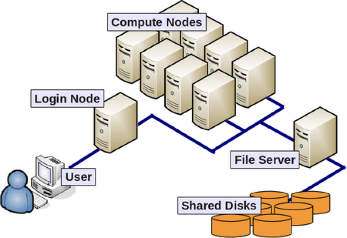
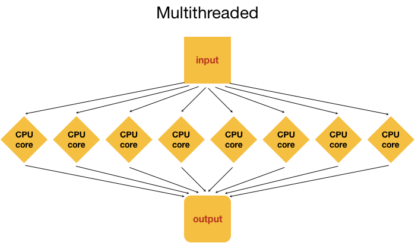
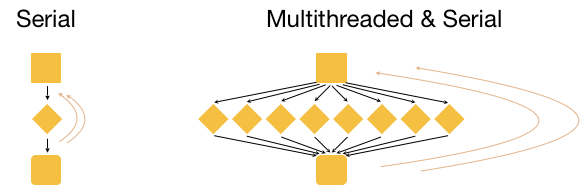
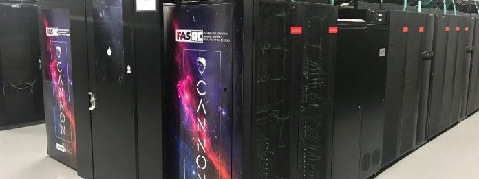

 <b>Click on the following questions to expand them for the answer</b> 
      

       
Do you have any of the following questions about bioinformatics analysis?
 
        <ul><li>Do you want to utilize high-throughput sequencing data in your research, but not really sure where to start?</li>
        <li>Does the idea of writing your own code for data analysis seem necessary, yet daunting?</li>
        <li>Do you need to brush up on what you already know about analysis of high-throughput sequencing data?</li></ul> 
          <b>If the answer to any of the questions is *yes*, or even *maybe*, then you are on the right page! </b>  
          Before we tell you about [our program](), we want to describe some of the jargon & concepts you will encounter. If you are familiar with the concepts below, you can skip this FAQ.
      

      
 
       
What the heck is 'omics?
 
          Over the last 10-15 years many technological advances allow us to assess the entirety of a certain type of molecule(s) in an organsim. The resulting high-throughput data are called 'omics data. We can break 'omics down into 4 specific categories:  
<ul><li>genOMICS - The study of the complete set of **DNA** in an organism, sigle cells, or group of cells.</li>
<li>transcriptOMICS - The study of the complete set of **RNA** in an organism, sigle cells, or group of cells.</li>
<li>proteOMICS - The study of the complete set of **Proteins** in an organism, sigle cells, or group of cells.</li>
<li>metabolOMICS - The study of the complete set of **Metabolites** in an organism, sigle cells, or group of cells.</li></ul> 
High-throughput data from even a single sample is considered 'omics data. However, we usually are looking at data from large number of biological samples (individuals, cell lines, etc).  
<em><b>We will be focusing the rest of these Q&As around Genomics and Transcriptomics!</em></b> 

      

       
What is High-throughput Sequencing (HTS) or Next-generation Sequencing (NGS) data
 
         Answer to question
      

       
       
How do clusters and HPC relate to analysis of HTS data?
 
          Answer to question
      

 
       
What is shell and how does it relate to clusters?
 
         Answer to question
      

       
       
What is R and what can it do?
 
          Answer to question
      

     
       
Where do I go from here?
 
         Answer to question
      

## What is High-throughput Sequencing (HTS) or Next-generation Sequencing (NGS) data

* What is a Genome? *all of the DNA in an individual or a species*
* What is a Transcriptome? *all of the RNA in an individual or a species (typically transcribed from DNA in individual cells)*

Both, genomes and transcriptomes, contain hundreds of millions or billions of nucleic acid units or [bases/base pairs](https://en.wikipedia.org/wiki/Base_pair) (A,T,G,C). Compare that to the average length of a book, which is 375,000 characters. To "read" the sequence of As, Ts, Gs and Cs, we use different methods (a lot of which are PCR-based). The most basic way to sequence DNA is using [Sanger Sequencing](https://en.wikipedia.org/wiki/Sanger_sequencing). Reading those bases one at a time using the Sanger method takes a very long time with high per-base costs, but it was creatively utilized to complete the [Human Genome Project (HGP) 1990 - 2003](https://en.wikipedia.org/wiki/Human_Genome_Project). 

With the massive advancements spurred by the HGP, the field of "next-generation" sequencing exploded and had rapidly advanced such that now we are able to sequence a whole genome within a day, at a nominal cost. The analyses of these **big data** generated by HTS is the challenge at present.

> Over the last few years the community is slowly replacing the term NGS (Next-generation Sequencing) with the more descriptive HTS (High-throughput Sequencing).

There are [hundreds of assays](https://www.illumina.com/science/sequencing-method-explorer.html) that have been developed for HTS that have enabled us to gain deep insights into the working of a cell. The most commonly used HTS applications that you will encounter are:
* Bulk RNA-seq
* Single-cell RNA-seq
* ChIP-seq
* Whole genome sequencing
* Exome sequencing
* ATAC-seq
* Single-cell ATAC-seq

## How do clusters and HPC relate to analysis of HTS data?

Let's return to our book example. If one book is 375,000 characters then 3.2 billion characters (the size of the human genome) translates to 8,533 books! While we might keep tens or even hundreds of books at our house, most people will never have thousands. 

Can you imagine dusting this?

It's the same with our local computer.  While we might keep small data files on our laptop, we don't want to clutter it up with huge data files. And this is just thinking about storage! Books or data sets need to be organized and kept track of as well. You might be able to alphabetize or organize a hundred books on your own but working with >8,000 books would be overwhelming! The same goes for our computer. To organize billions of base pairs and make sense of our sequencing data we simply need more power. The mac laptop I am writing this on has 10 cores (a single unit of processing available in our CPU; see below for more information). In comparison, a high perfomance computing (HPC) cluster might have hundreds or thousands of cores. That is a lot more processing capacity, more in line with the large amount of computational work we want to do!

Let's take a quick look at the basic architecture of a cluster environment and some cluster-specific jargon.

The above image reflects the many computers that make up a **"cluster"** of computers. Each individual computer in the cluster is usually a lot more powerful than any laptop or desktop computer we are used to working with, and is referred to as a **"node"** (instead of computer). Each node has a designated role, either for logging in or for performing computational analysis/work. **A given cluster will usually have a few login nodes and several compute nodes.** Each individual node in an HPC environment is a lot **more powerful** than any laptop or desktop computer we are used to working with. What we mean by *powerful* here is that each of these nodes have:

  * a lot more memory (temporary storage)
  * many more, faster CPUs
  * each of those CPUs has many more cores

E.g. A cluster “Node” that has eight “quad"-core CPUs, means that node has 32 cores (ability to process 32 computations at a time).

The data on a cluster is also stored differently than what we are used to with our laptops and desktops, in that it is not computer- or node-specific storage, but it is external and is available to all the nodes in a cluster. This ensures that you don't have to worry about which node is working on your analysis.

### Why use the cluster or an HPC environment?

1. A lot of software is designed to work with the resources on an HPC environment and is either unavailable for, or unusable on, a personal computer.
2. If you are performing analysis on large data files (e.g. high-throughput sequencing data), you should work on the cluster to avoid issues with memory and to get the analysis done a lot faster with the superior processing capacity. Essentially, a cluster has:
    * 100s of cores for processing!
    * 100s of Gigabytes or Petabytes of storage!
    * 100s of Gigabytes of memory!

### Parallelization

Point #2 in the last section brings us to the idea of **parallelization** or parallel computing that enables us to efficiently use the resources available on the cluster.

#### One input file

Let's start with the most basic idea of processing 1 input file to generate 1 output (result) file. On a personal computer this would happen with a single core in the CPU. 

On a cluster we have access to many cores on a single node, so in theory we could split up the analysis of a single file into multiple distinct processes and use as many cores to speed up the generation of an output file. This is called **multithreading**, i.e. using multiple threads or cores. As you can imagine, multithreading can speed up how fast the analysis is performed! In the example below, the input file is analyzed using 8 cores, likely resulting in an 8 fold speed up!

> **Note:** Multithreading is done internally by analysis tools being employed, and **not** by manually splitting the input (except in very unusual circumstances).

#### Three input files

Now, what if we had 3 input files? Well, we could process these files **in serial**, i.e. use the same core(s) over and over again, as shown in the image below.

This is great, but it is not as efficient as multithreading each analysis, and using a set of 8 cores for each of the three input samples. This is actually considered to be true parallelization.

With parallelization, several samples can be analysed at the same time!

## What is shell and how does it relate to clusters?

So how might you actually use a cluster? Unfortunately you can't just walk up to where the cluster is stored and start using it. Clusters are accessed remotely, that means that you connect to the cluster from your own computer. You will do this from the **command line** or a text-based user interface. We are used to clicking on applications we want to use and selecting various commands from dropdown menus. Clusters do not work this way. Any task that you want a cluster to do has to be communicated through a text command.

The FAS-RC Cluster

If you have never taken a computer science course or worked with clusters before this will all be brand new to you. But don't worry, we have [courses for that](https://hbctraining.github.io/Intro-to-shell-flipped/schedule/links-to-lessons.html)! 

For now let's just review the basics. To look at command line on your own computer you can open the Terminal program on Macs or for Windows download the [Git BASH](https://gitforwindows.org/) or similar application. The **shell** is what runs in these programs to interpret your commands. These programs all use [Bash](https://en.wikipedia.org/wiki/Bash_Unix_shell), a command language. As you get into HTS and computational work you will encounter a lot of languages such as Python, Perl, Fortran, R, C++, Java and more. You can think of these as being akin to human languages; French and English sound very different and have different syntax (the order of words) but can be used to convey the same message. At HBC training we recommend that you become familiar (or fluent) in bash and R to begin with.  

## What is R and what can it do?

Why do we recommend R instead of other languages? According to [R-project](https://www.r-project.org/about.html) R is "R is a language and environment for statistical computing and graphics." R is also a well developed and relatively simple language that is widely used among data scientists and people in STEM. Compelling arguements for learning R include:

* It’s open-source. This means no fees or licenses are needed and you won't get any pop ups asking for money.
* It’s platform-independent. This means that R runs on all operating systems (mac, windows, unix) and R scripts written on on platform can be run on any other platform.
* People write packages for R, especially in the field of bioinformatics. The R language has more than 10,000 packages stored in the CRAN repository, and that number is continuously increasing. Many packages for analyzing HTS data are written for R such as DESeq2 and Seurat among other.
* Data wrangling, i.e., turning raw data into the desired format. Data wrangling is necessary for working with any 'omics data set and R has many packages that can turn unstructured, messy data into a structured format.
* Great plotting programs. R has wonderful packages to make publication ready figures. We even have a [workshop](https://hbctraining.github.io/Training-modules/publication_perfect/) devoted to it!
* It’s great for statistics. Unlike SAS which is very costly R is free and has many different statistical packages available.
* You can use R for Machine Learning. R is ideal for machine learning operations such as regression and classification and even for artificial neural network development.
* R is growing. R has a solid support program and help with issues is widely available. New packages and features are available regularly! 

## Where do I go from here?

Hopefully you now feel like you have a grasp on some of these terms. If you want to start getting your hands wet, we recommend that you take our [Intro to R Course](https://hbctraining.github.io/Intro-to-R-flipped/schedules/links-to-lessons.html) and the appropriate shell intro for the cluster you will use, either [O2](https://hbctraining.github.io/Intro-to-shell-flipped/schedule/links-to-lessons.html) or [FAS-RC](https://hbctraining.github.io/Intro-to-shell-fasrc-flipped/schedule/links-to-lessons.html). You are free to take a workshop with us or work through the lessons yourself at your own pace. See our [main page](https://hbctraining.github.io/main/) for all course offerings. Happy Computing!
