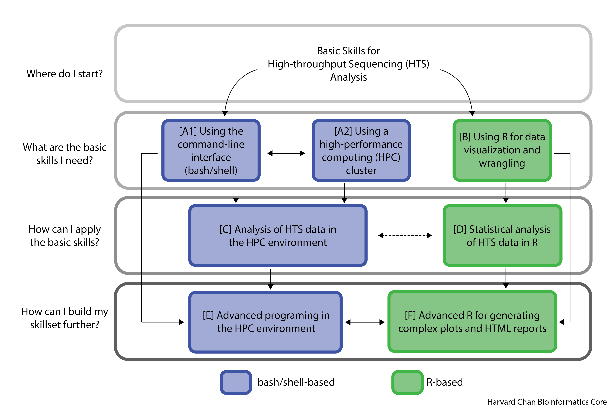

<h1 align="center">
Welcome to the HBC Training Program
</h1>
<h3 align="center">
We are delighted to have you here!
</h3>

The training team at the Harvard Chan Bioinformatics Core provides bioinformatics to help biologists become comfortable with using tools to analyse high-throughput sequencing (HTS) data. 

We offer courses and skills at three different levels starting at the basics and building upwards. We focus on the two most commonly used HTS interfaces, **R** and **Bash/Shell**.

## Not sure where to start? Click on our Q&A below!

  
<b>Click here to open the FAQ</b>

     <b>Click on the following questions to expand them for the answer</b> 
      

       
What if I am ....

         Answer to question
      

      

        
How can I ....

          Answer to question
      

      

       
Do I need to ....

         Answer to question
      

See our current workshop schedule on our [training website](http://bioinformatics.sph.harvard.edu/training#for-hsci-and-on-quad-hms-researchers). More detailed information about our courses is found below.

## What are the basic skills I need?

| Skill | Who needs it | Overview | Courses |
| :----: | :----: | :----: | :----: |
|**A1** - Using the command line interface | <ul><li>Anyone planning on doing scientific computing on any computer</li>  | Understanding the need for shell and master basic commands | <ul><li>[Introduction to the command-line interface (shell) - O2 cluster](https://hbctraining.github.io/Intro-to-shell-flipped/schedule/links-to-lessons.html)</li><li>[Introduction to the command-line interface (shell) - FAS-RC cluster](https://hbctraining.github.io/Intro-to-shell-fasrc-flipped/schedule/links-to-lessons.html)</li></ul>|
|**A2** - Using a HPC cluster | <ul><li>Anyone planning on doing scientific computing on a cluster</li> | Understanding the components of a cluser, learning to navigate and properly use the Harvard clusters | <ul><li>[Introduction to the command-line interface (shell) - O2 cluster](https://hbctraining.github.io/Intro-to-shell-flipped/schedule/links-to-lessons.html)</li><li>[Introduction to the command-line interface (shell) - FAS-RC cluster](https://hbctraining.github.io/Intro-to-shell-fasrc-flipped/schedule/links-to-lessons.html)</li></ul>|
|**B** - Using R  | <ul><li>Anyone who wants to learn a programming language for data science and statistics</li><li>Anyone who wants to use popular R packages such as Seurat and DESEQ2</li></ul> | Learning the basic R and RStudio interface, Basic R syntax, and data visualization | <ul><li>[Introduction to R](https://hbctraining.github.io/Intro-to-R-flipped/schedules/links-to-lessons.html)</li><li>[Introduction to R (video tutorials)](https://projects.iq.harvard.edu/hcatrresource/)</li></ul> |

***

## How can I apply the basic skills?

| Skill | Who needs it | Overview | Courses |
| :----: | :----: | :----: | :----: |
| **C** - Analysis of HTS data in the HPC environment | <ul><li>Anyone planning on doing genomic or transcriptomic sequencing of any kind </li> | Analysis of bulk RNAseq data, Variant calling, Chromatin biology, and pipeline automation | <ul><li>[Introduction to (bulk) RNA-seq using High-Performance Computing - O2 cluster](https://hbctraining.github.io/Intro-to-rnaseq-hpc-salmon-flipped/schedule/links-to-lessons.html)</li><li>[Introduction to (bulk) RNA-seq using High-Performance Computing - FAS-RC cluster](https://hbctraining.github.io/Intro-to-rnaseq-fasrc-salmon-flipped/schedule/links-to-lessons.html)</li><li>[Understanding chromatin biology using high throughput sequencing](https://github.com/hbctraining/Intro-to-ChIPseq-flipped)</li><li>[Variant calling](https://github.com/hbctraining/variant_analysis)</li></ul> |
| **D** - Statistical Analysis of HTS data in R|<ul><li>Anyone who wants to use popular R packages for HTS data such as Seurat or DESEQ2</li></ul> | Learning Workflows of pipelines designed to analyze various forms of HTS data and understanding each step | <ul><li>[Introduction to Differential Gene Expression](https://github.com/hbctraining/DGE_workshop_salmon_online/tree/master/schedule)</li><li>[Introduction to single cell RNA-seq Analysis](https://hbctraining.github.io/scRNA-seq_online/schedule/links-to-lessons.html)</li></ul>|  

  
***  
  
## How can I build my skillset further?
  
| Skill | Who needs it | Overview | Courses |
| :----: | :----: | :----: | :----: |
| **E** - Advanced programming with the bash command line | <ul><li>Anyone who wants to make custom scripts or pipelines</li></ul> | Learning to include version control in your projects and advanced bash scripting | <ul><li>[Improving your (RNA-seq) data analysis using version control (Git)](https://hbctraining.github.io/versioning_data_scripts/)</li><li>[Accessing genomic reference and experimental sequencing data](https://hbctraining.github.io/Accessing_public_genomic_data)</li></ul>|
| **F** - Advanced R for generating complex plots and reports | <ul><li>Anyone who wants to make publication level figures</li><li>Anyone who wants to make high level HTML reports of analyses| Exploring additional R features such as reports and publication perfect figures|<ul><li>[Publication Perfect](https://hbctraining.github.io/Training-modules/publication_perfect)</li><li>[Generating research analysis reports with RMarkdown](https://hbctraining.github.io/Training-modules/Rmarkdown)</li></ul>|
  
***  
  
  
  
  
  
## Additional Courses
- [Introduction to Python](https://hbctraining.github.io/Training-modules/Python)
- [Version control using GitKraken](https://github.com/hbctraining/version-control-gitkraken)
  
  
  ***

# Contact us:

**Email:** [hbctraining@hsph.harvard.edu](mailto:hbctraining@hsph.harvard.edu)

**Webpage:** [http://bioinformatics.sph.harvard.edu/training/](http://bioinformatics.sph.harvard.edu/training/)

  
  
