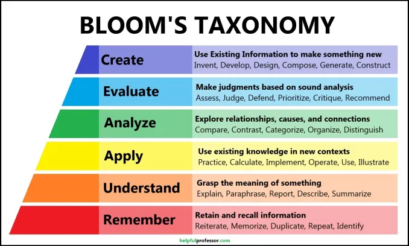
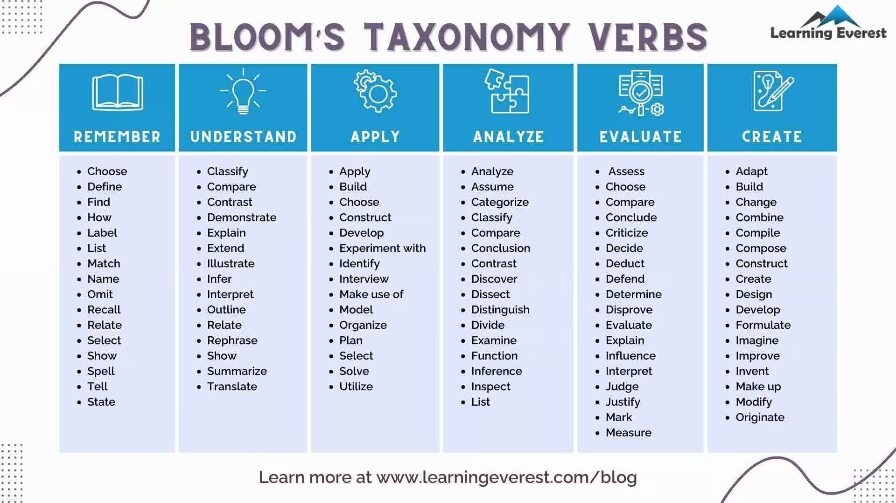

# Training Development Guidelines

This is a guide to help create continuity across our training materials. It is a living document and will try to be maintained to the best of our ability. Contributions from team members are welcomed and encouraged.

## Working as a team

When working on developing course materials, if can be helpful to work as a team. What we have found when people work alone on material development is that it can be isolating and daunting. Working as a team has a few advantages over solo course development:

1. Spreads the course development workload
2. Gives you a sounding board for ideas
3. Helps keep the development on track with someone else holding you accountable
4. Gives a different perspective on material
5. More fun to be doing it with someone else


## Course Design Philosophy

"Traditional" course design is often regarded as a process through which the instructor develops materials and then uses the principles from those materials to create an assessment. The "downfall" of this strategy is that it can result in teaching things that aren't assessed and can sometimes feel a bit meandering in the learning. 

**Backward Design** principles are a set of principles for course design which **focus on how students will be assessed and then work to develop materials that align with those assessment goals**. When we apply backward design principles in our course development it should follow these steps:

1. Identify what goals we want participants to accomplish
2. Create an assessments that will certify that the goals was obtained
3. Develop materials aimed at ensuring that students will be successful at these assessments

When you are planning a workshop or a lesson it can be really helpful to develop, even if it is very rudimentary (you can always come back to this later), what exercises you want the participants to do first. This will tremendously help guide your development process, because you will be developing *toward* an assessment.

Vanderbilt has a nice [webpage](https://cft.vanderbilt.edu/guides-sub-pages/understanding-by-design/) on Backward Design.


## Phases of design

### 1. Identifying a dataset

This *can* be one of the most time-consuming parts of development. When designing our workshops, we want to be using publically available data. People outside of Harvard oftentimes use our resources and they need to be able to access the dataset via SRA/GEO. In the past we have used data from studies where the training team members have been involved in the analysis and are co-authors, so there is a good depth of knowledge on it.

We also want to avoid to much unnecessary complexity to the data. Choose a dataset with at least three replicates and at least two sample classes. If there are many group, can we narrow the dataset to just case and control conditions or that which we need for the workshop? We don't want the complexity of the dataset to take away from the learning. _Obtain all metadata information for samples used in the study._

When trying to identify a dataset, it is recommended to work closely with Platforms as you can have them help you test run different datasets through Nextflow pipelines more easily.

Once we have the dataset, it is good practice to **run it through the workflow** we are teaching. This can be done in partnership with the [Platforms](https://hbc.github.io/Platform/) group members. Our goal is to train researchers using the best practices established within HBC, and therefore we should have a pipleine or code set up to do much of what we are teaching. If results do not pan out, or there are issues with the dataset we may want to consider using a different dataset.

There will be circumstances where **custom code is created** for the workshop. Create reproducible shell scripts or Rmd files which walk through the code and interpretation of results. _Do not begin development until we know that the code is running, and we are happy with the results._

**Where do we put the data and the code?**

* Large datasets can be placed on O2 in `/n/groups/hbctraining`. You will want to create a folder for the workshop and setup a basic organization that is easy to navigate. Let management know if you need access to the group folder or the space has reached it's quota for storage.
* If we have toy datasets (i.e for Intro to Shell) we should host them on Dropbox and/or GitHub. If on DropBox, it can be put in `Teaching/Courses/workshop_data`. If in the GitHub repo, place it in a `data` folder. Ideally it is good to have everything on GitHub, but sometimes there are file size issues with GitHub. First try for GitHub if we can, but if file size constricts us, then Dropbox.
* In the GitHub repo, create a folder called 'scripts'. Here, you can place all code used in the workshop. Ideally, you would like a script for each lesson, but it can also be consolidated if there is not much code per lesson.

### 2. Setting a repo and proposed schedule
Create a private repo in the [HBC GitHub account](https://github.com/hbctraining). Give it a meaningful workshop name and add description. Click the box to intialize the repo with a README file. To make this a **custom GitHub Pages HTML** (in the same format that all of our training materials are rendered) you will need to follow instructions outlined on [this page](https://github.com/hbctraining/main/blob/master/GitHub_pages/Pages_documentation.md#edit-pages-settings).

Once the repo is set up, you will need to **set up the workshop README page**. You may not have details for all sections, but it is good to set up a skeleton draft that you can always come back to you as you develop the workshop. The main headers include:

* Title of workshop (H1)
* A table with Audience, Computational skills required, and Duration
* Workshop description
* Learning objectives for the workshop
   * Work through these with the team. It's good to have a shared understanding of what it is that you hope participants get out of this workshop. There is more on Learning Objectives described later in these guidelines.
* Lessons: Include two links in bullet points. One to the workshop schedule page, another to the self-learning links.
* Installation requirements

You can **create folders** at this point or do it as you need them. Some examples include `lessons`, `schedule`, `data` and `scripts`.

It is a good idea to hash out a **proposed schedule** for the workshop. You may want to do this in a shared Google doc at first. This way you can take notes on what would be contained in each lesson, jot notes on whether or not it would be in-class or self-learning.

_Finally, be sure to include Zenodo citation at the end (we need to come up with a protocol for this) with the RRID, and an attribution footer._


### 3. Timeline and Milestones
When we work as a team on materials development, we need to explicitly lay out an overarching timeline for the project at the beginning with ample cushion time built-in. **Work backwards from one week prior to the proposed date of workshop.** If there is not enough time, consider moving the workshop date.

**How many weeks is reasonable?** Discussion point.

Once the timeline is established:

1. Assign tasks for each week and estimate the hours required to accomplish each task, so it is clear to everyone working on the development project. Set reasonable expectations such that the tasks can be feasibly completed within the timeframe. 
2. Set up 30 minute standing meetings for each week. It is not mandatory to meet every week, but there should be a slot available in case there are things to be discussed. 
3. Create milestones for a general completion of certain things. For example, by X date we would expect the first draft of Day 1 lessons to be complete. Account for extra time attributed to unexpected issues and troubleshooting.
4. At each weekly meeting assess and give feedback on the progress made since the last meeting.
5. **Try to avoid spending more than ~5 hours on development without getting at least some feedback on it.** It can be very easy to spend too much time and go too far down a rabbit hole and bill too much time for development.

### 4. Creating a lesson
This is the suggested framework for creating a lesson.

#### 4.1. Learning objectives and Assessments

Identify your **Learning Objectives** and draft a rough idea of your **assessments for those Learning Objectives**

It is critical that learning objectives are:

- *Measurable* - It is critical that you can assess whether a learning objective has been achieved
- *Specific* - Focus on what we are specifically aiming for participants to get out of the lesson
- *Achievable* - Participants can accomplish the learning objective given the resources in the lesson

You will likely find that this **might be one of the more difficult parts of the lesson to develop**, but it will provide guidance for how you develop the lesson. When you are developing learning objectives, consider where on _Bloom's Taxonomy_ (see below) you are aiming for workshop participants to be reaching. Not all learning objectives for the lesson need to be at the higher levels of Bloom's taxonomy. A variety can be beneficial and also is probably an accurate reflection of the level our materials should be taught at. For example, we likely won't ask participants to "Construct a read alignment algorithm", but being able to "Paraphrase or identify key steps in the read alignment process" is likely a more reasonable expectation.

<p align="center">

</p>

*Image from https://tigerlearn.fhsu.edu/the-revised-blooms-taxonomy-as-a-framework-for-writing-learning-objectives/*

Try to pick a verb that is going to pair well with the level in Bloom's Taxonomy you are hoping participants will reach _AND_ with your assessment. For example, if your Learning Objective is "Identify the key steps in bwa's read alignment algorithm" then the assessment should be something like "Which of these steps are part of bwa's read alignment algorithm" and not something like "Compare bwa and HISAT2's read alignment algorithms". 

Picking the right verb for your learning objective can be really helpful for creating your assessment of that learning objective. Below is a great table of more verbs associated with each level of Bloom's Taxonomy.

<p align="center">

</p>

*Image from https://www.learningeverest.com/blooms-taxonomy-decoded/*

Boston College also has a nice [webpage](https://cteresources.bc.edu/documentation/learning-objectives/) on creating learning objectives.


#### 4.2 Framework of the lesson

In the repository you will have a `lessons` folder which will contain a markdown (.md file) for each lesson. You can create all skeleton lessons based on the schedule, or you can create them as you work on the lesson. This framework should be very minimalistic in content.

The general format of the page should be:

1. YAML
2. Additional documentation
3. Learning Objectives
4. Brief introduction including the step in workflow image
5. Content
   * Headings
   * Subheadings
   * Pseudocode of what the participants for the workshop will be doing (don't worry about the exact code or parameters at this point unless you are just copy-and-pasting them from somewhere, but something like "bwa align to mm10 reference" is fine)
   * Drafts of exercises/assessments, these don't need to be final and it could be something like "have participants run FASTQC on sample 2"
   * Text where image will go describing it like "image showing the pseudobulk process". If you know this image exists and we already have developed it somewhere, feel free to embed it but don't create any images at this point
7. Navigation buttons to the "Next Lesson" and "Back to Schedule"; but don't link them to any pages yet as names will likely change
8. License Footer

Get approval from your collaborator(s) on the framework before proceeding.

#### 4.3 Filling in the lesson
The next few steps of creating the lesson are outlined below:

1. Begin to flesh out skeleton lesson by adding in content for each learning objective. Be sure to explain to define new concepts, give analogies where possible and be sure to include citations where material is take from another source.
2. Incorporate your collaborator's feedback and design initial drafts for any figures/GIFs/apps (guidelines below on these) that will be embedded in the materials
3. After completing a learning objective, show it to your collaborator for feedback
4. Once a first draft of the lesson is complete, have a third-party review your materials and provide feedback. The third-party should recognize that this is still in a draft state. Fixing typos, etc. is not the goal here but rather, does the flow make sense to them, is the lesson clear, does the assessment address the learning objective, etc.
5. Incorporate third-party's feedback into the lesson
6. Create more finished products for the figures/GIFs/apps as needed, and try tidying the lesson up, fixing typos, checking links, making sure things are rendering correctly in the HTML
7. Third-party polish. This is the final polish for a lesson, the final polisher must:
    - Run all of the code to ensure it works
    - Work from the HTML page to ensure renderings are correct
    - Address any typos they see
    - Check each link to ensure they work


Below, we elaborate on specific concepts described when creating the lessson.

### YAML
The top of the page should have a YAML that contains some metadata for the page and looks like:

```
---
title: "Title that will appear over the DNA image"
author: "List of contributing authors"
date: "Date"
---
```

### Additional documentation
This section includes a list of contributing authors and the approximate time the lesson should take to complete. It may feel difficult to estimate a time when starting, but even estimating a time can help give you a framework to try to work within. When someone reviews the materials, it can be a good idea for them to update that approximate time if need be.

```
Contributors: List of contributing authors

Approximate time: XX minutes
```

Also, include a cutdown workflow image to show particiapnts where they are in the workflow process.


### Text
Text is important for conveying ideas, but long paragraphs and text-heavy lessons can be diificult for retaining participants' attention. Major ideas should be stated in text, but they can also be supplemented by:

- Images
- GIFs
- Equations
- Dropdowns
- Apps

You can also break-up paragraphs by using bullet points when you are listing anything. This creates a more diversive set of visuals for the reader and also it oftentimes more difficult to teach material that is in paragraph form as opposed to other mediums. A good rule of thumb (but not a hard rule) is to try to avoid more than 2 consecutive paragraphs of text. 

### Images
Images are an integral part of conveying information in conjunction with text. 

Considerations for images:

**Does the perfect figure already exist somewhere else?**

Sometimes people have created excellent figures in papers and there is no need to re-invent the wheel. If you go down this route, be sure to provide appropriate attribution underneath the figure with:

"*Image from [source]*"

**Creating our own figures**

Figures that we create should follow some guidelines:

- *High-resolution* - Others in our group or elsewhere may recycle this figure and we would like the figure to be clear at different size scalings than we present. By providing high-resolution images, we can try to future-proof this.

- *Clarity* - **Each figure should try to convey a single takeaway point.** Only include details relevant for the point we are trying to convey with an image. We can make multiple images for different points. Try to avoid cramming an image with too many details it can be distracting and lose sight of the overall goal.

* Be sure to label the axes on any plots.

* Use colorblind-friendly color palettes when creating figures.

* If working from screenshots, make sure the interface is clean (i.e. hide the dock on Mac, clean up your Desktop, etc.)

* Put a figure description underneath the figure to let the reader and instructor know what the take-home message is from a figure. Sometimes figures get put into a lesson and make sense to the person embeddding them, but it isn't quite so obvious to others.

* *Attribution* - On the figures we develop, put "Harvard Chan Bioinformatics Core" in the bottom right corner. This builds attribution into a figure, so if someone uses our figure and forgets to attribute us, we are still attributed.

* *Management* - It is encouraged to use Adobe Illustrator to create images. Please keep any images used in creating images, like screenshots, in the same folder as the Illustrator file (.ai) along with the final PNG/SVG image on Dropbox. 

### GIFs

When using graphical user interfaces (GUIs) like IGV or FileZilla, it can be beneficial to supplement the text with GIFs rather than screenshots to show how to interact with the interface. When deciding to create a GIF, have these considerations:

- **Is a GIF needed for this?** - While GIFs are great, they can be a bit time-consuming to make. GIFs can be great when working through menus, but is a screenshot will suffice then sometimes that is the better option.
- **Is this GUI rather stable (i.e. IGV/RStudio/FileZilla)?** - Creating GIFs are more time-consuming than screenshots so if a tool is not in a stable state, it would likely be preferable to use screenshots over spending the time to create, and then inevitably re-create, the GIF
- **Can I break this task into short segments?** - To work within the framework of High-Definition and not drop too many frames (less than about 12.5fps), you'll need to keep the final GIF to about 10 seconds or less in order for it to be small enough to upload to GitHub which has a 25MB file size limit.

Many of the same considerations that existed for images, also exist for GIFs. 

- *High-Definition* - Export the GIF in high-definition

- *Clarity* - Try to not make the GIF go too fast. It is important that workshop participants can follow it. Consider highlighting selections with boxes or arrows.

- *Attribution* - On the GIFs we develop, put "Harvard Chan Bioinformatics Core" in the bottom right corner.

- *Management* - It is encouraged to use Adobe Premiere Pro to create GIFs. Please keep any files used in creating GIFs, like screen capture videos, in the same folder as the Premiere Pro file (.prproj) along with the final GIF on Dropbox. 

### Equations

Sometimes we people have a habit of writing out equations in words like: 

"The gravitational force is the gravitational constant times the mass of first object times the mass of the second object divided by the distance between the center of two bodies squared"

Perhaps some may find this useful, but it can be a lot more clear to provide equations ***AND*** define the elements of the equation. For example in the previous example is only the distance between the center of the two bodies squared or is the entire equation squared. [Codecogs](https://editor.codecogs.com/) provides a nice way to embed equations as images in our GitHub documents

If possible, providing toy examples and tables to help make the outcomes of the equations more intuitive. For example, instead of the gravitational example above, we could do:

<p align="center">

</p>

where:

- _F<sub>gravity</sub>_ is the gravitational force
- _G_ is the gravitational constant
- _M<sub>1</sub>_ is the mass of object 1
- _M<sub>2</sub>_ is the mass of object 2
- _D_ is the distance between the two objects

Then consider having an image that displays or even an app that allows the participants to toy with the relationships between the variables. In the interest of time, we haven't done this here, but if this were to be course materials, we would. This allows participants multiple ways to in engage with the material. Some find equations to be daunting to look at and find plots or apps showing toy data more intuitive. 

> Note: When using an equation, define all of the variables.

### Shiny Apps

Sometimes a topic can benefit from an app that allows workshop participants to toy around with. Developing one of these apps can be time-consuming, so please check with your collaborator and Meeta before developing it to make sure that the budget can accommodate it. When embedding the app you will use this syntax:

```
<iframe src="https://hcbc.connect.hms.harvard.edu/app_name/?showcase=0" width="800" height="600px" data-external="1"></iframe>
```

GitHub Markdown does not accomodate iframe, but this will be visualized on the HTML page. Our materials on RShiny can be found [here](https://hbctraining.github.io/Training-modules/RShiny/).

### Extra Details

Sometimes not all of the content that is developed is 100% relevant to the workshop, but could be for people with slightly different data, addresses outdated approaches or provides alternative analytical approaches. When we come to these "Extra details" we have two approaches, Dropdowns and Linking Out.

### Dropdowns

Oftentimes you will come across places where there are two reasonable approaches to a task or want to provide more information on that is not critical for participant's immediate success, but is still information that people might like to have. If brief, these are a great place to use a dropdown. The syntax for these dropdowns look like:

```
<details>
<summary>Click here to expand the dropdown menu</summary>
You couldn't see this menu before, but now you can. Click the &quot;Click here to expand the dropdown menu&quot; again to hide this.
</details>
```

And they look like:

<details>
<summary>Click here to expand the dropdown menu</summary>
You couldn't see this menu before, but now you can. Click the &quot;Click here to expand the dropdown menu&quot; again to hide this.
</details>

When you are using a dropdown, **ONLY USE HTML WITHIN THE DROPDOWN. DO NOT USE MARKDOWN FORMATTING WITHIN THE DROPDOWN**. When working within a dropdown, you can use the HTML formatting found in [this guide](GitHub_HTML_reference.md).

Also, be aware that some special characters like <, >, &, ', ", # can give wonky results. 

Always check the output in the HTML Page to make sure that it hasn't created problems for the rest of your Markdown.

### Linking Out

If there is enough content to flesh out a supplemental GitHub page, then this is too much content for a dropdown. You can make a new Markdown page for this content and link out to it from the current Markdown. Before creating a linked out page of additional content, be sure to consult with your collaborator and Meeta to make sure that this content is important enough to create this page AND will still allow us to stay within out time budget.

### Footer

All of the pages need to have the following footer:

*These materials have been developed by members of the teaching team at the [Harvard Chan Bioinformatics Core (HBC)](http://bioinformatics.sph.harvard.edu/). These are open access materials distributed under the terms of the [Creative Commons Attribution license](https://creativecommons.org/licenses/by/4.0/) (CC BY 4.0), which permits unrestricted use, distribution, and reproduction in any medium, provided the original author and source are credited.*

The main page for a repository should also have our Zenodo citation and include our RRID, *SCR_025373*.
