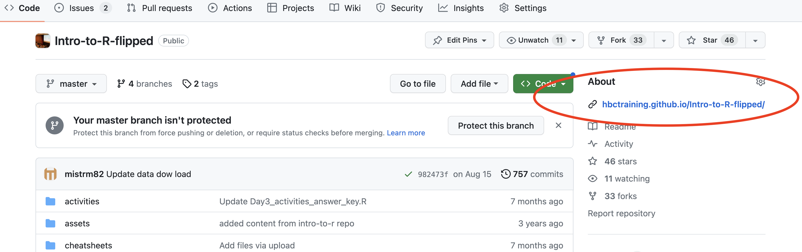

## A guide to teaching an HBC workshop 

These are some guidelines on things to think about when teaching your first workshop. 

### Leading up to the workshop 

* **Decide who is teaching what in-class section(s) and self-learning sections, and become comfortable with your section(s)**
  * Recognize where personal expertise will let you add to the material, or what can be skimmed over quickly
  * Familiarize yourself with concepts and anticipate where questions might arise
  * Identify sections where pausing to get green checkmarks or confirmation of understanding is prudent (such as prepping an R workspace, a chunk of R code, or an important concept)
  * Walk-through a lesson with another instructor (practice run)
 
>   * Rendered html versions of your class can be found in the link directly below the *About* section on the righthand side of the main GitHub page for your class; these look more professional than presenting from the GitHub page directly
>  

> 
> 

    
* For R workshops:
     * install packages
     * run through code
     * save project for easy loading in class

* Familiarize yourself with any exercises/homework and make sure you understand the answers
     * Answers to in-class exercise are usually hyperlinked to the header "Exercises".
     * Answers to self-learning exercises/homework can be found in the links labeled *Answer Key* towards the bottom of the *schedule* page for the workshop on GitHub.
      
### The day of the workshop (usually after Day 1)

**Consider doing these tasks in tandem with your teaching partner**

1) **Run code from self-learning.** For R, this should be done in your individual projects on your personal computers (in some cases there are objects you can load). For shell, one instructor should be assigned to run code prior to class (instructors share a single training account).  
2) **Decide who will answer which [Poll Everywhere](https://pollev.com/hbctraining945) and email questions, if any**
   * Often, people don't submit questions until the night before or the morning before class, so check this 30-60 min before class
   * You may not know the answer off the top of your head and will need to do some prep
   * If a question is too time consuming to find an answer before/during class, you can always answer after class
   * These questions can help determine which self-learning sections to focus on   
2) **Review class homework submissions**
   * Homeworks can be found by searching for your class in [the HBC google forms](https://docs.google.com/forms/u/0/?tgif=d). Student answers can be found by clicking on the *Responses* tab
   * Correct answers to homeworks can be found in the links labeled *Answer Key* towards the bottom of the *schedule* page for the workshop on GitHub. They are also usually found in the *homework* folder in the Github repo for your course.
   * Most people don't submit homework until the night before, so check this 30-60 min before class 
   * This will help you determine what self-learning areas need to be focused on in class
3) **Familiarize yourself with the Zoom/Google polls for your sections**
   * Polls (and their answers) can be found in the *activities* folder of the GitHub repo for your class; 
   * Answers to polls can be found in the GitHub repo for individual classes
4) **Pull up materials you will need for the class**
   * Minimize other browsers and applications not needed for class. Quit programs with notfications or snooze them.
      * These can be distracting when you are teaching. 
   * Open up tabs with links to your sections and self-learning materials
   * Have RStudio open with your section project loaded. For Shell have the terminal window open logged in to O2.
   * Homework responses, if there is a particular issue you want to address
   * Poll question answer keys
5) **Log in to the zoom about 15 minutes early to discuss any issues with your teaching partner**
     * Open *Participants* and *Chat* windows so you can let people in from the waiting room, see green checkmarks, and see questions
     * Disable the "Sound on entry" option in Zoom

### During class: Start of class

1) **Encourage students to ask questions, but not to DM whoever is actively teaching**
2) If **homework** submissions are very few, you **can poll the class (with green stickies)** to see how many people at least had a chance to run all of the code. If it is very few, give people a chance to load pre-existing objects  (we usually have these linked in the lesson).

### During class: Self-learning discussion

1) **Ask for questions about that section before beginning; consider asking if this section was the one people struggled with the most if indicated by homework submission**
    * Encourage people to ask questions during the section
2) **Initate the poll for this section**
    * Give people a few minutes to answer questions
    * Share results of poll with the class
    * Go through the answers
3) **Briefly go through self-learning section, focusing on areas of need based on homeworks/polls, and conceptually important sections**
    * Pause and ask for questions
4)  **After all self-learning sections are done, consider taking a bio-break before starting the in-class portion**

### During class: In-class lesson(s)

#### Actively teaching:

 * Ask for green checkmarks where appropriate (such as prepping an R workspace, a chunk of R code, or an important concept)
 * Include your own expertise and experience as part of the lesson where appropriate (but avoid going on long tangents)
 * Ask for students to volunteer answers to exercises and discuss answers; discuss why incorrect answers are incorrect

#### Troubleshooting/Not actively teaching:

 * Consider asking, where appropriate, a relevant question if there is something of interest the speaker has forgotten or could elaborate on
 * Point out to the speaker if there is a question in the chat, or ask the question yourself
 * Field private questions; occasionally some private questions are appropriate for the whole class and you can offer those types of questions up to the speaker
