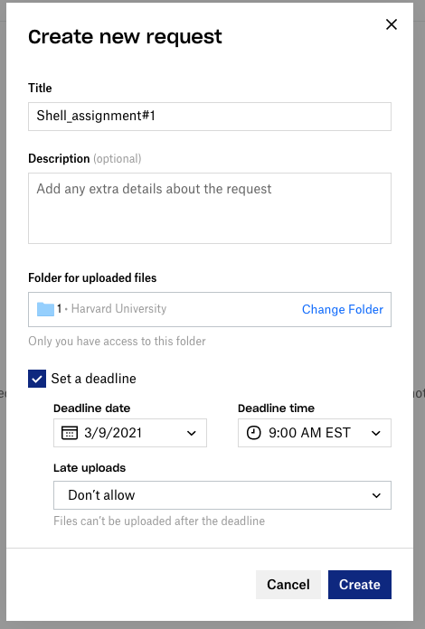

# Online Workshop – Lead Instructor Responsibilities

## Maria will perform the following:

1. Set up the Zoom meeting
    - Select dates/times; recurring meeting 
    - Waiting room
    - Mute participants upon entry
    - Once meeting created edit “Email settings”
      - Contact: HBC Training Team
      - Email: hbctraining@hsph.harvard.edu
      - Edit email body
    - Add poll questions
  
2. Send hosts/instructors links to register

3. Register students as sessionInfo() emails come in
    - Check spreadsheet in DropBox
    - Click on Registration link in DropBox and manually enter participantsimg/dropbox_re

## Lead instructor duties (for all workshops)

> **NOTE:** For Shell (and Shell-based) workshops se additional responsibilities below.

1. Ensure hosts/instructors register manually

2. Remind Radhika to add polls

4. Update workshop schedule where necessary
    - Instructors
    - Timings 
    - Lessons
    - Any language updates on the schedule page

5. Check workshop repo to see if there are any issues to be addressed

6. Update the DropBox links for homework submission:
    
    - Delete the old homework submissions
    - Go to the appropriate DropBox folder
    - Right click and select "Request files..."
    - Clicking on "Request files..." will bring you online
    - Name your request and add a deadline
    
    

7. PollEverywhere:
    - Remove old questions
    - Create a Google doc for Poll everywhere questions. Members of the team can populate it as questions come in.
   
8. Update Intro and Wrap-up slides
    - Add slide for modules (temporary)
    - Add that we can provide experimental design help (temporary)
    - Update links to update data management workshops at Countway
    - Check that tinyurl links are correct and working
    - Check that funding information is correct
    - Update to the "Odds and Ends" slide (as Zoom changes our stickie situation) 
    - If necessary, update keynote and generate new pdf for upload to GitHub
    
9. Make sure Exit survey is ready

11. Review hbctraining emails to ensure all class-related emails are answered

12. Once workshop is complete:
    * If needed, clear the environment and remove any scripts so project is ready for next class.
    * Remind Radhika to add information about who attended to the registration doc
    * Send an email to everyone reminding them:
        * to fill out the exit survey
        * the schedule page and links will be available for the forseeable future (add link)
        * that resources are listed at the bottom of the schedule page

## Lead Instructor duties for Shell workshops

1. Request training accounts from HMS-RC (about two weeks prior)
    - Submit a ticket to RC-help but cc Andy and Kathleen
    - Provide dates and times of training
    - Provide number of accounts
    - Provide resources (advising students to use at most 3 cores and at most 1GB of memory)
2. Email Kathleen (or another RCC) to check O2 slides for any updates.
3. Create a Google sheets with the attendees names and assign training accounts. Example can be found [here](https://docs.google.com/spreadsheets/d/1fxpzu5NU20y_Wh4ILZXa9YRh6JzXulTulaoOJ0mmNTs/edit#gid=0)
